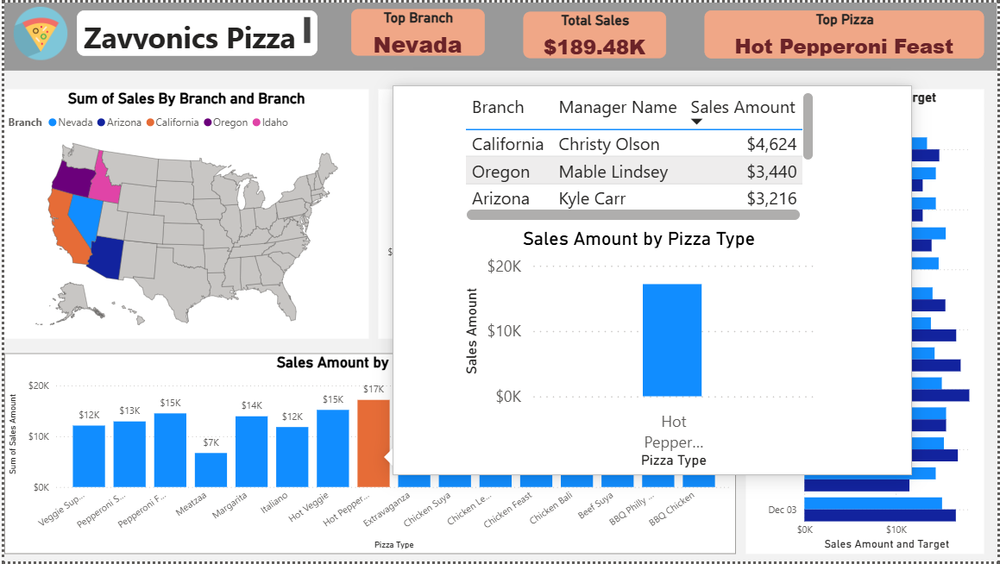

# 🍕 Pizza Sales Analytics Dashboard | Power BI

> 📊 An interactive Business Intelligence dashboard built using **Power BI**, **Power Query**, and **DAX** to analyze pizza sales performance, monitor KPIs, and generate actionable business insights through dynamic visualizations and advanced reporting features.

---

## 📖 Project Overview

The **Pizza Sales Analytics Dashboard** is an end-to-end Business Intelligence project developed in **Power BI** to transform raw sales data into meaningful insights.

The dashboard enables stakeholders to monitor sales performance, evaluate product popularity, compare branch performance, analyze manager contributions, and make informed business decisions using interactive visualizations.

This project demonstrates real-world Business Intelligence concepts, including **data transformation**, **data modeling**, **DAX calculations**, **interactive dashboards**, **drill-through navigation**, and **custom report tooltips**.

---

# 🎯 Business Objectives

This dashboard was designed to help answer key business questions such as:

- 💰 What is the total sales revenue?
- 🍕 Which pizza generates the highest sales?
- 🏪 Which branch performs the best?
- 👨‍💼 Which manager contributes the most revenue?
- 📈 Are daily sales meeting the target?
- 🗺️ Which regions generate the highest revenue?
- 📊 How do different pizza types perform?
- 🔍 How can users explore detailed information interactively?

---

# 🛠️ Tech Stack

| Technology | Purpose |
|------------|---------|
| 📊 Power BI | Dashboard Development |
| ⚡ Power Query | Data Cleaning & Transformation |
| 🧮 DAX | Measures & KPIs |
| 📁 Microsoft Excel | Dataset |
| 📈 Data Visualization | Business Insights |

---

# ✨ Dashboard Features

✅ Executive Dashboard

✅ Interactive KPI Cards

✅ Sales Performance Analysis

✅ Branch-wise Sales Analysis

✅ Manager-wise Performance

✅ Pizza Category Analysis

✅ Sales Target Comparison

✅ Interactive Map Visualization

✅ Dynamic Filtering

✅ Cross Filtering

✅ Cross Highlighting

✅ Drill Through Navigation

✅ Custom Report Tooltips

✅ Detailed Analysis Page

---

# 📊 Dashboard Preview

## 🏠 Executive Dashboard

### Overview

The Executive Dashboard provides a comprehensive summary of overall business performance using interactive KPIs and visual analytics.

Users can quickly identify:

- 💰 Total Sales
- 🏪 Top Performing Branch
- 🍕 Best Selling Pizza
- 👨‍💼 Manager Performance
- 📈 Sales vs Target
- 🗺️ Geographic Sales Distribution
- 📊 Revenue by Pizza Type

This dashboard serves as the primary landing page for business users and executives.

---

# 🗺️ Branch Sales Analysis

The map visualization highlights sales performance across different branches within the United States.

### Benefits

- Compare branch performance
- Identify high-performing regions
- Discover geographical sales trends
- Support regional business decisions

---

# 👨‍💼 Manager Performance Analysis

The donut chart displays each manager's contribution toward overall sales revenue.

Business users can quickly identify:

- Highest-performing manager
- Revenue contribution
- Percentage share
- Performance comparison

---

# 🍕 Pizza Performance Analysis

The column chart compares revenue generated by each pizza type.

This visualization helps identify:

- Best-selling pizzas
- Lowest-performing pizzas
- Customer preferences
- Product profitability

---

# 🎯 Sales Target Analysis

The Sales vs Target visual compares actual sales against predefined targets.

It enables management to monitor:

- Daily performance
- Goal achievement
- Sales gaps
- Operational efficiency

---

# 🔍 Drill Through Functionality

## 📌 Overview

This report includes Power BI's **Drill Through** feature to provide detailed analysis for selected data points.

Users can simply:

**Right Click → Drill Through → Detailed Page**

The report automatically filters the detailed page according to the selected value.

### Benefits

- 🔎 Detailed record-level analysis
- 📊 Dynamic filtering
- 🚀 Improved user experience
- 📈 Faster decision-making
- 🧠 Self-service analytics

---

# 📄 Detailed Analysis Page

The Detailed Analysis page displays filtered information based on the user's selected branch, manager, or pizza type.

Displayed information includes:

- 🏪 Selected Branch
- 👨‍💼 Manager Name
- 💰 Sales Amount
- 🍕 Related Pizza Type
- 📊 Dynamic Charts
- 📋 Detailed Records

This feature enables users to investigate business performance without overwhelming the main dashboard.

---

# 💬 Custom Report Tooltip

Instead of using Power BI's default tooltip, this project implements a **Custom Report Tooltip**.

When users hover over a visual, an interactive mini-dashboard appears containing additional business insights.

### Tooltip Includes

- 👨‍💼 Manager Name
- 🏪 Branch
- 💰 Sales Amount
- 📈 Related Chart
- 🎯 Context-based Filtering

This creates a smoother and more interactive user experience.

---

# 📈 Key Performance Indicators (KPIs)

| KPI | Description |
|------|-------------|
| 💰 Total Sales | Total revenue generated from pizza sales |
| 🏪 Top Branch | Highest-performing branch |
| 🍕 Top Pizza | Best-selling pizza |
| 👨‍💼 Top Manager | Highest revenue-generating manager |
| 🎯 Sales vs Target | Performance comparison against targets |

---

# 💡 Business Insights

The dashboard provides valuable insights, including:

- 📈 Identified the highest revenue-generating branch.
- 🍕 Determined the best-selling pizza products.
- 👨‍💼 Compared manager performance.
- 🎯 Tracked actual sales against targets.
- 🗺️ Visualized branch-wise sales geographically.
- 📊 Evaluated pizza category performance.
- 🔍 Enabled detailed exploration through Drill Through.
- 💬 Improved user experience using Custom Tooltips.
- 📈 Supported data-driven business decision-making.

---

# 🚀 Power BI Skills Demonstrated

- 📊 Dashboard Design
- ⚡ Power Query (ETL)
- 🧹 Data Cleaning
- 🧩 Data Modeling
- 🔗 Relationships
- 🧮 DAX Measures
- 📈 KPI Development
- 🎨 Data Visualization
- 🗺️ Map Visualizations
- 🍩 Donut Charts
- 📊 Bar & Column Charts
- 📋 Matrix Tables
- 🎯 Interactive Slicers
- 🔄 Cross Filtering
- 🔍 Drill Through
- 💬 Custom Tooltips
- 📈 Business Intelligence Reporting

---

# 🎓 Skills Gained

- ✔ Business Intelligence
- ✔ Data Analysis
- ✔ Dashboard Development
- ✔ Power BI
- ✔ Power Query
- ✔ DAX
- ✔ Data Modeling
- ✔ Data Visualization
- ✔ Analytical Thinking
- ✔ KPI Design
- ✔ Business Storytelling

---

# 👨‍💻 Author

## **Muzammil Saleem**

🎓 Data Analyst | Power BI Analyst  

- 💼 LinkedIn: *(https://www.linkedin.com/in/muzammil-saleem-9ba004285)*
- 💻 GitHub: *(https://github.com/muzammil-code709)*

---

# ⭐ Support

If you found this project helpful or insightful, consider giving this repository a **⭐ Star**.

Your support is greatly appreciated!

---

> 🚀 **Transforming raw data into actionable business insights through interactive dashboards and data-driven storytelling.**
